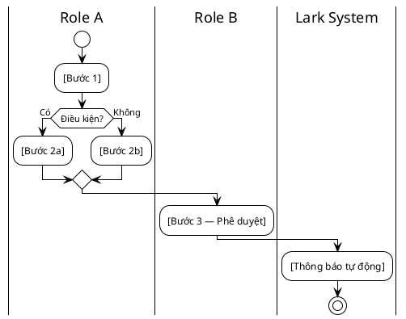

# Giai đoạn 6: Xây Dựng Tài Liệu Hướng Dẫn End-User (User Documentation)

**Mô tả:** Giai đoạn này đảm bảo mỗi actor tham gia quy trình đều có tài liệu hướng dẫn cụ thể để sử dụng hệ thống đúng cách, giảm thiểu lỗi vận hành và phụ thuộc vào consultant sau khi bàn giao.

> Tài liệu tốt = Hệ thống vận hành tốt không cần người hỗ trợ liên tục.

**Khi nào bắt đầu:** Ngay sau khi Build (Giai đoạn 5) hoàn thành và trước buổi Đào tạo chính thức với khách hàng.

---

## Nguyên tắc viết tài liệu end-user

- **Viết theo vai trò (Role-based):** Mỗi actor có hướng dẫn riêng. Nhân viên kho không cần đọc hướng dẫn của Giám đốc.
- **Action-first:** Bắt đầu bằng hành động, không bắt đầu bằng lý thuyết. Ví dụ: "Để tạo đơn hàng: Vào Base → Nhấn [+] → Điền {trường này}".
- **Có ảnh/video minh hoạ:** Mỗi bước quan trọng cần có screenshot hoặc screen recording ngắn.
- **Kịch bản lỗi thường gặp:** Ghi rõ "Nếu thấy lỗi X → làm Y", giảm ticket hỗ trợ.

---

## Các bước triển khai

### Bước 1: Liệt kê tất cả Actor & Quy trình họ tham gia
Lấy từ bảng Roles & Responsibilities trong BA Report:

| Actor | Quy trình tham gia | Hành động cần hướng dẫn | Tài liệu cần tạo |
|---|---|---|---|
| Nhân viên kinh doanh | Tạo đơn hàng | Điền Base, tạo Approval | `Tao_Don_Hang_Guide.md` |
| Trưởng phòng | Duyệt đề xuất | Inbox Approval, nhận Bot | `Duyet_De_Xuat_Guide.md` |
| Giám đốc | Xem Dashboard | Lọc dữ liệu, xuất báo cáo | `Xem_Dashboard_Guide.md` |

### Bước 2: Viết hướng dẫn theo cấu trúc chuẩn

> Từ phiên bản 1.1, mỗi client có **1 file User Guide duy nhất** (`06_User_Guide.md`) bao gồm tất cả roles. Dùng template [[Tpl_User_Guide]].

**Cấu trúc chuẩn của `06_User_Guide.md`:**

| Section | Nội dung |
|---|---|
| **Phần 1: Giới thiệu** | Mục đích, đối tượng sử dụng, phạm vi |
| **Phần 2: Tổng quan hệ thống** | Bảng công cụ Lark + sơ đồ luồng dữ liệu PlantUML |
| **Phần 3: Quy trình chi tiết** | Mỗi quy trình gồm: Swimlane + Bảng form + Edge cases |
| **Phần 4: Theo từng Role** | Từng usecase cụ thể của từng nhân sự (bước-bước) |
| **Phần 5: FAQ** | Câu hỏi thường gặp |
| **Phần 6: Liên hệ hỗ trợ** | Ai liên hệ khi gặp vấn đề gì |

#### Chuẩn PlantUML Swimlane cho mỗi quy trình

Mỗi quy trình phải có **sơ đồ swimlane** thể hiện:
- **Actors/Lanes:** Mỗi role là 1 lane riêng (`|Role Name|`)
- **Các bước thực hiện** theo thứ tự
- **Rẽ nhánh `if/else`** cho mọi edge case và điều kiện trong quy trình
- **Tự động hóa (`Lark System / Bot`)** là 1 lane riêng



#### Chuẩn Bảng Form cho mỗi bước

Mỗi bước yêu cầu nhập liệu phải có bảng:

| # | Trường thông tin | Kiểu dữ liệu | Bắt buộc | Hướng dẫn điền |
|---|---|---|---|---|
| 1 | [Tên field] | Text / Số / Date / Select | ✅ / ❌ | [Mô tả + ví dụ cụ thể] |

### Bước 3: Tổ chức tài liệu trong hồ sơ khách hàng

Lưu toàn bộ tài liệu end-user vào thư mục client:
```
05_Clients/[TenCongTy]/
└── 06_User_Guide.md     ← 1 file duy nhất, bao gồm tất cả roles và quy trình
```

> **Tại sao 1 file?** Giúp consultant dễ maintain, khách hàng dễ chia sẻ, tránh link broken giữa các file riêng lẻ.

### Bước 4: Bàn giao và đào tạo

| Hình thức | Mô tả | Khi nào |
|---|---|---|
| **Training session** | Đào tạo trực tiếp/online theo vai trò | Trước go-live 1 tuần |
| **Tài liệu tự đọc** | Chia sẻ link tài liệu lên Lark Wiki hoặc Doc | Sau training |
| **Video ngắn** | Record màn hình từng quy trình (3-5 phút) | Nên có nếu team > 20 người |
| **QA session** | Buổi hỏi đáp trực tiếp | Sau go-live 1-2 tuần |

---

## Tiêu chuẩn đầu ra (Input / Output)
- **Input:** Hệ thống Build hoàn chỉnh (Giai đoạn 5), Danh sách Actor từ BA Report.
- **Output (Hard Gate):** Ít nhất **1 tài liệu hướng dẫn cho mỗi actor** tham gia quy trình chính. Lưu vào `06_User_Guide/` trong hồ sơ khách hàng.

## Các Template liên quan
- Hồ sơ khách hàng: [[README|05_Clients]]
- Mẫu dự án khách hàng: [[Tpl_Client_Project]]
