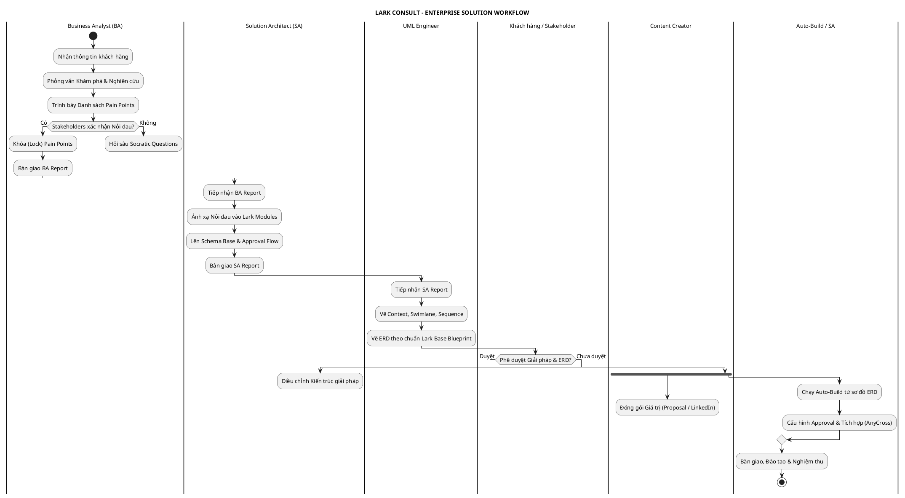

# Tổng Quan Quy Trình Tư Vấn Triển Khai Giải Pháp Lark

## 1. Mô tả quy trình Consultant
Quy trình Tư vấn Triển khai Giải pháp (Enterprise Solution Workflow) là phương pháp luận chuẩn mực của Lark Consult nhằm phân tích, thiết kế, và xây dựng hệ thống số hóa toàn diện trên nền tảng Lark Suite. Quy trình này kết hợp chuyên môn phân tích nghiệp vụ, kiến trúc hệ thống, thiết kế kỹ thuật (UML), và tự động hóa xây dựng Base để đảm bảo giải pháp bàn giao tối ưu nhất cho khách hàng.

## 2. Khi nào bắt đầu diễn ra?
Quy trình này chính thức kích hoạt ngay sau khi khách hàng đồng ý tìm hiểu và sử dụng dịch vụ Tư vấn & Triển khai của Lark Consult, đặc biệt đối với các doanh nghiệp có nhu cầu cấu trúc lại toàn bộ luồng vận hành (Custom Lark Consultation) hoặc giải bài toán doanh nghiệp phức tạp.

---

## 3. Sơ đồ Luồng Công Việc (Consulting Workflow)
Sơ đồ dưới đây thể hiện toàn cảnh dòng chảy thông tin và sự phối hợp giữa các chuyên gia trong hệ thống tư vấn của Lark Consult.

---

## 4. Các bước triển khai chi tiết & Liên kết tài liệu

### Giai đoạn 1: Khám phá & Xác nhận (Discovery)
- **Actor:** Business Analyst (BA)
- **Mô tả cụ thể:** BA làm việc trực tiếp với khách hàng để ánh xạ (map) các quy trình kinh doanh hiện tại và đào sâu vào các "nỗi đau" (pain points).
- **Quy trình chi tiết:** Xem tại 👉 [[01_Kham_pha_nhu_cau_BA]]
- **Input đầu vào:** File ghi chú trao đổi, hiện trạng quy trình cũ (Sử dụng biểu mẫu [[Tpl_Thong_tin_Khach]]).
- **Output (Gate 1):** Báo cáo phân tích nghiệp vụ với Pain Points đã được khách hàng xác nhận bằng văn bản (Sử dụng biểu mẫu [[Tpl_BA_Report]]).

### Giai đoạn 2: Lên Chiến lược & Giải pháp (Strategy)
- **Actor:** Lark Solution Architect (SA)
- **Mô tả cụ thể:** SA thiết kế cách cấu trúc hệ thống, quy hoạch luồng dữ liệu, chọn Modules và thiết lập vai trò của Lark (Keep/Integrate/Replace hệ thống cũ).
- **Quy trình chi tiết:** Xem tại 👉 [[02_Chien_luoc_SA]]
- **Input đầu vào:** Báo cáo [[Tpl_BA_Report]] (Bắt buộc).
- **Output (Gate 2):** Tài liệu phân hệ giải pháp (TO-BE), Data Schema và Handoff Notes (Sử dụng biểu mẫu [[Tpl_SA_Report]]).

### Giai đoạn 3: Thiết kế Hệ thống Thực thi (Design)
- **Actor:** UML Engineer
- **Mô tả cụ thể:** Chuyển hóa bản thiết kế SA thành các bản vẽ kỹ thuật chi tiết như ERD và Sequence Diagrams bằng code PlantUML.
- **Quy trình chi tiết:** Xem tại 👉 [[03_Thiet_ke_UML]]
- **Input đầu vào:** Báo cáo [[Tpl_SA_Report]].
- **Output (Gate 3):** Kho sơ đồ PlantUML chuẩn xác (Sử dụng Snippet tại [[Tpl_UML_Guide]]). Bắt buộc phải có sự phê duyệt ERD của khách hàng để tiến tới Build.

### Giai đoạn 4: Đóng gói Giá trị (Branding & Proposal)
- **Actor:** Content Creator / Sales
- **Mô tả cụ thể:** Viết các Case Study, bài LinkedIn hoặc đề xuất báo giá (Proposal) làm nổi bật việc giải pháp sẽ giúp các sếp quản lý "nhàn hơn" ra sao dựa trên các Usecase mẫu.
- **Input đầu vào:** Sơ đồ giải pháp đã chốt từ Giao đoạn 3, Usecase tham khảo (ví dụ mẫu [[Tpl_Usecase]]).
- **Output:** Bản Proposal thương mại chốt sales / Bài viết Case Study.

### Giai đoạn 5: Xây dựng & Tự động hóa (Build)
- **Actor:** Lark Solution Architect & Bot Auto-Build (Lark MCP)
- **Mô tả cụ thể:** Kích hoạt tính năng Auto-build. Hệ thống tự động đọc sơ đồ ERD đã duyệt để tạo lập tự động các bảng Lark Base, Workflow Approval. Triển khai cấu trúc Data Base chuẩn xác ngay từ giây đầu tiên.
- **Input đầu vào:** Sơ đồ ERD (PlantUML) đã được duyệt.
- **Output:** Ứng dụng Lark Base hoàn chỉnh, Automation chạy mượt mà, bàn giao tận tay khách hàng.
