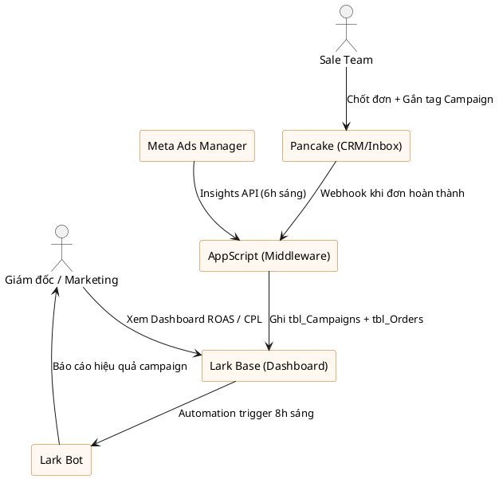
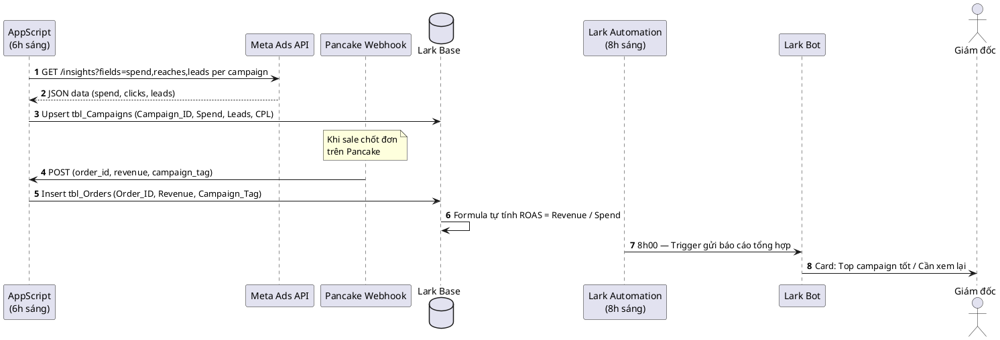
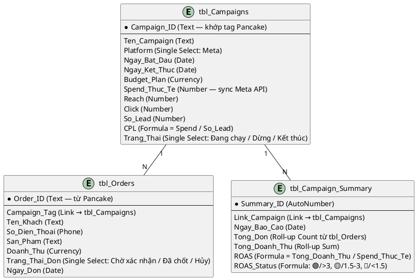

# Usecase: Đánh giá Hiệu quả Chiến dịch Ads — Thời Trang SME

Usecase này dành cho **doanh nghiệp thời trang mới mở**, đội ngũ gọn nhẹ (Giám đốc kiêm Marketing + Sale team). Mục tiêu: biết ngay chiến dịch Meta Ads nào đang sinh đơn thật, chiến dịch nào đốt tiền không hiệu quả — tất cả tập trung trên Lark, không cần mở 3-4 tab để đối chiếu.

---

## TÓM TẮT GIÁ TRỊ (Dành cho Giám đốc)

- **Sáng 8h:** Bot Lark gửi báo cáo ngày hôm qua — Campaign nào ra nhiều đơn, ROAS bao nhiêu, CPL bao nhiêu.
- **Nhìn 1 Dashboard:** So sánh tất cả chiến dịch đang chạy cùng lúc, màu đỏ/xanh rõ ràng.
- **Quyết định nhanh:** Cái nào ROAS tốt → tăng budget. Cái nào CPL cao, không chốt đơn → tắt hoặc edit creative.
- **Sale team không phải nhớ nguồn lead:** Khi chốt đơn trên Pancake, chỉ cần gán tag Campaign → hệ thống tự tổng hợp.

---

## GIAI ĐOẠN 1: BA REPORT — PHÂN TÍCH HIỆN TRẠNG

### 1. Business Context & Roles

- **Mô hình:** Thời trang D2C (Direct-to-Consumer), mới mở, bán online là chủ lực.
- **Quy mô:** Lean team — Giám đốc kiêm Marketing, 2-5 nhân viên Sale.
- **Kênh bán:** Meta Ads (Facebook/Instagram) → Inbox → Pancake (quản lý hội thoại + chốt đơn).

| Actor | Vai trò | Nỗi đau hiện tại |
|---|---|---|
| Giám đốc / Marketing | Ra quyết định ngân sách ads, thiết kế campaign | Không biết campaign nào thật sự ra đơn, quyết định dựa theo cảm tính |
| Sale team (2-5 người) | Nhận lead từ Pancake inbox, tư vấn, chốt đơn | Không biết khách đến từ campaign nào để tư vấn đúng góc |

### 2. Công cụ hiện tại (Current Systems)

| Công cụ | Dùng để làm gì | Rủi ro |
|---|---|---|
| Meta Ads Manager | Chạy và theo dõi campaign | Chỉ thấy số click/reach — không biết click nào ra đơn thật |
| Pancake | Quản lý inbox, ghi đơn, quản lý khách | Dữ liệu đơn hàng không link về được campaign cụ thể |
| Lark (đang dùng) | Chat nội bộ, chưa có hệ thống Base | Chưa khai thác được |
| Excel / ghi tay | Tổng hợp cuối ngày | Mất thời gian, hay thiếu sót |

### 3. Nỗi Đau Lõi (Pain Locks)

**PAIN P-01 — Mù mờ ROI theo Campaign:**
> *"Tôi chạy 3-4 campaign cùng lúc. Meta báo CPL của tất cả 45k nhưng tôi không biết campaign nào thật sự ra đơn. Toàn phải nhắn sale team hỏi thủ công."*
- **Impact:** Ra quyết định tắt/tăng budget sai chiều, lãng phí ngân sách ads.
- **Severity:** 🔴 Critical

**PAIN P-02 — Sale team không ghi nhận nguồn lead:**
> *"Khách vào inbox nhiều lắm nhưng sale đâu nhớ khách này từ bài quảng cáo nào. Hỏi thì đoán mò."*
- **Impact:** Không có dữ liệu để tính conversion rate thật theo campaign.
- **Severity:** 🔴 Critical

**PAIN P-03 — Báo cáo chậm, không real-time:**
> *"Cuối ngày tôi phải mở Pancake xem tay, mở Meta xem tay, rồi ngồi cộng lại. Mất 30-45 phút mỗi tối trong khi đang bận trăm thứ."*
- **Impact:** Quyết định ads hôm nay dựa vào số của hôm qua hoặc hôm kia.
- **Severity:** 🟡 Significant

---

## GIAI ĐOẠN 2: SA REPORT — KIẾN TRÚC GIẢI PHÁP

### 1. Vai trò của Lark & Chiến lược Tích hợp

| Hệ thống | Chiến lược | Giải thích |
|---|---|---|
| **Meta Ads Manager** | Integrate (API) | Dùng AppScript gọi Meta Ads Insights API, kéo số liệu campaign về Lark Base mỗi ngày |
| **Pancake** | Integrate (API/Webhook) | Khi đơn hàng đổi trạng thái → Webhook → AppScript → ghi vào Lark Base |
| **Lark Base** | Core Operational Layer | Dashboard tổng hợp: Campaign Performance + Order Attribution |
| **Lark Bot** | Reporting Layer | Gửi báo cáo ngày tự động 8h sáng vào nhóm chat GĐ + Sale |

### 2. Kiến trúc High-Level

```
[Meta Ads Manager]
    → AppScript (Time-trigger: 6h sáng mỗi ngày)
        → Gọi Meta Insights API → kéo: spend, reach, clicks, CPL theo campaign
            → Ghi vào Lark Base: tbl_Campaigns

[Pancake]
    → Webhook (khi đơn = "Đã chốt" / "Hoàn thành")
        → AppScript WebApp (doPost)
            → Ghi vào Lark Base: tbl_Orders (kèm Campaign_Tag)

[Lark Base]
    tbl_Campaigns ←→ tbl_Orders (linked qua Campaign_ID)
        → tbl_Campaign_Summary (Tổng hợp: Chi phí / Số đơn / ROAS)
            → Lark Dashboard View (GĐ xem bảng màu đỏ/xanh)
                → Lark Bot: 8h sáng gửi báo cáo tóm tắt vào Nhóm Chat
```

### 3. Giải pháp chi tiết theo Pain

**Giải pháp P-01 & P-03 — Dashboard Campaign:**
- AppScript chạy lúc 6h sáng, gọi Meta Marketing API v18+
- Lấy theo từng Ad Set: `campaign_name`, `spend`, `reach`, `clicks`, `leads` (nếu dùng Lead Ads form)
- Ghi vào `tbl_Campaigns` → Lark tự tính Formula `CPL = Spend / Leads`, `ROAS = Revenue / Spend`
- `ROAS_Status` (Formula): nếu ROAS > 3 → "🟢 Tốt", 1.5-3 → "🟡 Trung bình", < 1.5 → "🔴 Cần xem lại"

**Giải pháp P-02 — Attribution đơn hàng về Campaign:**
- Sale team khi chốt đơn trên Pancake: **bắt buộc gắn tag = tên campaign** (ví dụ: `#spring2025_vay`, `#testvideo_ao`)
- Pancake Webhook đẩy về AppScript khi đơn hoàn thành: ghi `Order_ID`, `Revenue`, `Campaign_Tag` vào `tbl_Orders`
- Lark Base dùng linked field: `tbl_Campaigns` ←→ `tbl_Orders` để tổng hợp tự động

**Giải pháp Bot báo cáo 8h sáng:**
- Automation trigger: mỗi ngày 8h00
- Action: Lark Bot gửi card vào nhóm GĐ + Sale nội dung:

```
📊 Báo cáo Ads ngày hôm qua — [DD/MM/YYYY]

🟢 Hiệu quả tốt:
  • Spring Collection Video — ROAS 4.2x | 8 đơn | CPL 38k
  • Váy Hè Flash Sale — ROAS 3.1x | 5 đơn | CPL 52k

🔴 Cần xem lại:
  • Test Áo Sơ Mi — ROAS 0.8x | 1 đơn | CPL 210k

💰 Tổng chi hôm qua: 2,400,000đ
📦 Tổng đơn xác nhận: 14 đơn
```

### 4. AppScript Strategy

| Job | Loại | Interval | Ghi chú |
|---|---|---|---|
| Kéo Meta Ads Insights | Time-trigger | 6h sáng hàng ngày | Gọi `/{act_id}/insights?fields=campaign_name,spend,reach,clicks,leads` |
| Nhận webhook Pancake | Event-driven | Khi có đơn mới/hoàn thành | `doPost(e)` — parse JSON, ghi Base |
| Trigger bot báo cáo | Time-trigger | 8h sáng hàng ngày | Sau khi data đã cập nhật từ 6h |

> 🔐 **Bảo mật:** Meta Access Token + Pancake API Key lưu trong `PropertiesService.getScriptProperties()` — không hardcode trong script.

### 5. API Catalog

| # | Endpoint | Method | Mục đích | Auth | Webhook? | Event | Retry? | Miss Event? |
|---|---|---|---|---|---|---|---|---|
| 1 | `graph.facebook.com/v18.0/{act_id}/insights` | GET | Kéo số liệu campaign Meta | Bearer Token (Access Token) | ❌ | — | ✅ | Gọi lại polling sáng hôm sau |
| 2 | `pancake.vn/api/v1/orders` | GET | Lấy danh sách đơn | API Key | ✅ | `order.completed` | ✅ | ✅ Có API polling bù |
| 3 | `lark.larksuite.com/open-apis/...` | POST | Ghi record vào Base / Gửi bot message | OAuth2 App Token | — | — | ✅ | — |

**Checklist tích hợp đã xác nhận:**
- [x] Meta: dùng Business Access Token — cần gia hạn 60 ngày, setup refresh tự động
- [x] Pancake: kiểm tra webhook event `order.completed` và `order.confirmed`
- [x] Lark: App token cho bot gửi tin + quyền ghi Lark Base

---

## GIAI ĐOẠN 3: UML — LARK BASE BLUEPRINT

### 3.1. Sơ đồ Ngữ cảnh (Context Diagram)


### 3.2. Sơ đồ Trình tự — Báo cáo Campaign hàng ngày


### 3.3. ERD — Lark Base Blueprint


---

## TRIỂN KHAI THỰC TẾ (Build Phase Guidelines)

### Thứ tự triển khai đề xuất

| Phase | Tuần | Nội dung | Output |
|---|---|---|---|
| **Phase 1 — Core Base** | 1-2 | Tạo 3 bảng Base, quy trình sale gắn tag Pancake, nhập data thủ công thử nghiệm | Sale team biết gắn tag, GĐ xem được bảng thô |
| **Phase 2 — Bot báo cáo** | 3 | Dựng Lark Bot + Automation báo cáo 8h sáng (dựa data nhập tay) | GĐ nhận báo cáo tự động hàng ngày |
| **Phase 3 — Auto-sync Meta** | 4-5 | Dựng AppScript kéo Meta API tự động 6h sáng | Dữ liệu spend/leads tự cập nhật không cần nhập tay |
| **Phase 4 — Pancake Webhook** | 6 | Setup webhook Pancake → AppScript → Base | Đơn hàng tự chảy về, ROAS tính tự động |

### Lưu ý quan trọng khi triển khai

1. **Meta Access Token:** Dùng System User Token trong Meta Business Manager (không dùng personal token — sẽ expire sau 60 ngày).
2. **Tag Campaign nhất quán:** GĐ phải quy ước tên Campaign_ID cố định (ví dụ: `SS25_VAY_VIDEO`) — dùng chính xác tên này làm tag Pancake. Nếu viết sai → không match → ROAS sai.
3. **Phase 1 chạy tay trước:** Đừng vội tích hợp API ngay. Sale team cần quen gắn tag 1-2 tuần trước khi auto-sync.
4. **Dashboard View GĐ:** Tạo Gallery View hoặc Table View với conditional color theo cột `ROAS_Status` — xanh/vàng/đỏ nhìn vào là biết ngay.

---

## KPI & ROI KỲ VỌNG

| Pain ID | Giải pháp | Baseline → Target |
|---|---|---|
| P-01 | Dashboard ROAS tự động | Ra quyết định tăng/cắt budget sau 3-5 ngày dữ liệu → Giảm lãng phí ads 20-30% |
| P-02 | Pancake tag + webhook | Attribution rate 0% → >80% đơn có nguồn campaign xác định |
| P-03 | Bot báo cáo 8h sáng | 45 phút/tối tổng hợp thủ công → 0 phút (GĐ chỉ đọc tin nhắn) |
