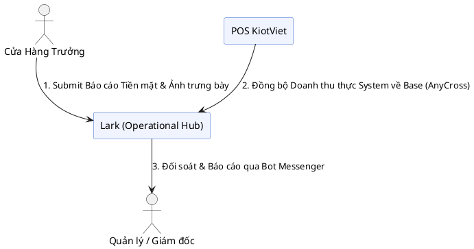
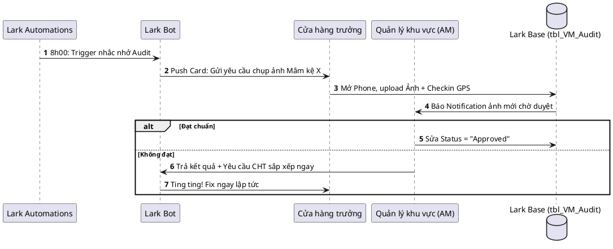
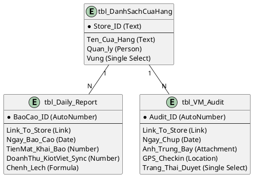

# Usecase Hàng Mẫu: Số hóa Vận hành Chuỗi cửa hàng Bán lẻ (Retail Operations)

Usecase này là phiên bản *Golden Standard* mô phỏng kết quả sau khi đã áp dụng chuẩn Hệ thống Tư vấn 3 Giai đoạn (BA -> SA -> UML) của Lark Consult. Phù hợp để làm tài liệu chuẩn mang đi chốt Sales hoặc làm Template cho đội triển khai.

---

## TÓM TẮT GIÁ TRỊ (Dành cho C-Level)
- **Mục tiêu:** Quản lý tập trung mọi điểm nghẽn tại cửa hàng (Doanh thu, Tồn kho, Chuẩn trưng bày, Sự chuẩn mực của nhân sự).
- **Lợi ích Sếp Nhàn Hơn:** 
  - Sáng thức dậy thấy AI Bot báo cáo tổng doanh thu toàn chuỗi trên nhóm Chat.
  - Không cần đi thị sát từng cửa hàng xem có bày biện đúng Guideline hay không (Đã có tính năng duyệt hình ảnh Audit trực tiếp trên điện thoại).
  - Không cần hối thúc Cửa hàng trưởng nộp báo cáo Excel cuối ngày.

---

## GIAI ĐOẠN 1: BA REPORT - PHÂN TÍCH HIỆN TRẠNG QUY TRÌNH BA_TO_BE

### 1. Business Context & Roles
- **Mô hình:** Chuỗi bán lẻ đa điểm (5 - 30 cửa hàng). Tốc độ mở điểm nhanh.
- **Actor chính:** Cửa hàng trưởng (Store Manager), Quản lý khu vực (Area Manager), Kế toán (Finance), Giám đốc (C-Level).
- **Công cụ cũ (Current Systems):** POS (KiotViet/Sapo) tính tiền mặt, Nhóm Zalo chụp ảnh báo cáo, Excel tổng hợp chấm công ca.

### 2. Các Nỗi Đau Lõi (Pain Locks)
- **PAIN P-01 (Mù mờ Tồn kho & Doanh số cuối ngày):**
    - *Statement:* "Máy POS chỉ cho số tiền, nhưng tiền nộp về thẻ ngân hàng hay tiền mặt lại thất thoát. Còn báo cáo Excel thì mờ mắt tôi mới đọc xong."
    - *Impact:* Kế toán mất 2-3 ngày để đối soát tiền. Sếp không có số liệu real-time.
- **PAIN P-02 (Chuẩn mực Trưng bày - Visual Merchandising bị ngó lơ):**
    - *Statement:* "Chiến dịch Marketing bắt đầu rồi mà tôi không biết cửa hàng A đã treo băng rôn đúng chỗ chưa. Quản lý thì chạy không xuể các điểm."
    - *Impact:* Bỏ lỡ cơ hội bán hàng (Drop sales), lãng phí ấn phẩm Marketing.

---

## GIAI ĐOẠN 2: LARK SA REPORT - KIẾN TRÚC CHIẾN LƯỢC

### 1. Vai trò của Lark và Chiến lược Tích hợp
- **Hệ thống POS (KiotViet/Sapo):** Được giữ lại (Keep) để thực hiện tính tiền, quét mã vạch và trừ kho.
- **Lark Base:** Trở thành *Operational Control Layer* - Nơi quản lý dữ liệu kiểm tra chéo (Doanh thu Cửa hàng trưởng báo cáo vs Doanh thu phần mềm kéo qua AnyCross).
- **Lark Bot & Forms:** Nhận dữ liệu kiểm tra cửa hàng (AuditVM) bằng hình ảnh.

### 2. Giải pháp cho P-01: Báo cáo vận hành cuối ngày
- Mở quy trình Lark Form trước lúc đóng ca. Cửa hàng trưởng nhập 2 con số tóm tắt: [Tiền Mặt Thu Được] + [Tiền Chuyển Khoản]. Cập nhật Base `tbl_Daily_Report`.
- Automation: 23:00 mỗi ngày, Bot lấy dữ liệu Base đó tính tổng các chi nhánh và nhắn tin tóm tắt vào nhóm Chat Quản Lý: *"Tóm tắt doanh thu 15 điểm bán ngày 28/03..."*

### 3. Giải pháp cho P-02: Quy trình Audit Trưng bày (VM)
- Mở Lark Base trang bị tính năng Check-in Location + Image Upload. 
- 8h00 Sáng, Bot gửi tin nhắn Task cho toàn bộ Cụm trưởng: *"Yêu cầu chụp góc chiến dịch X"*. Cụm trưởng upload hình. Area Manager thả Tim (Approve) ngay trên hình.

---

## GIAI ĐOẠN 3: UML ENGINEER - LARK BASE BLUEPRINT CHUẨN

Dưới đây là các sơ đồ hệ thống minh họa để xây dựng Auto-build hoặc trình bày cho Client.

### 3.1. Sơ đồ Ngữ cảnh (Context Diagram)

### 3.2. Sơ đồ Trình tự Audit Trưng Bày (Visual Merchandising)

### 3.3. Sơ đồ Lark Base Blueprint (Chuẩn Auto-Build)

---

## TRIỂN KHAI THỰC TẾ (Build Phase Guidelines)
- Chạy hệ thống Base bằng Auto-build từ Cấu trúc Bảng `tbl_Daily_Report` và `tbl_VM_Audit` ở trên.
- Trong Base `tbl_Daily_Report`: Viết trường Formula `[Chenh_Lech] = [DoanhThu_KiotViet_Sync] - [TienMat_Khai_Bao]`.
- Nối AnyCross từ KiotViet API để mỗi ngày lúc 22:00 update Data vào cột `DoanhThu_KiotViet_Sync` của Lark Base tương ứng với mã `Store_ID`. Lập tức Sếp bắt được lỗi lệch doanh thu để soi lại kế toán!
