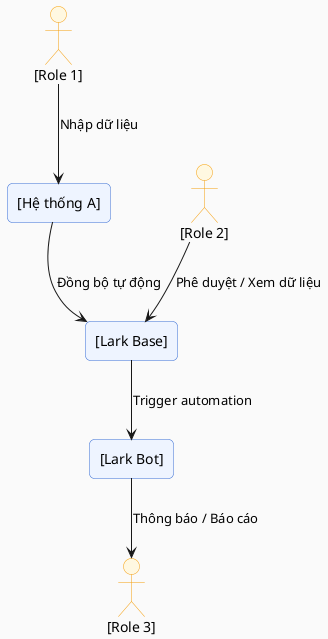
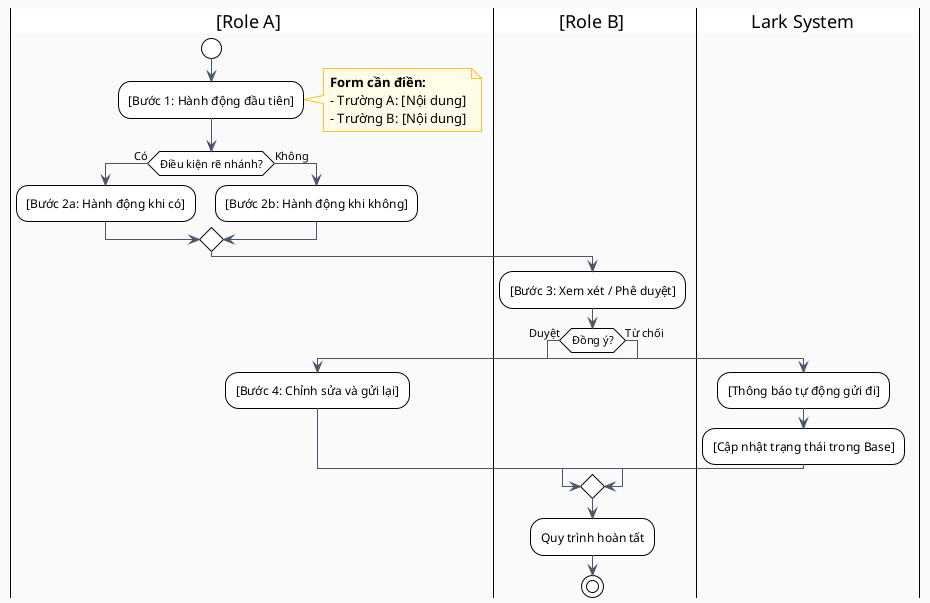

# 📘 Tài Liệu Hướng Dẫn Sử Dụng Hệ Thống — [Tên Công Ty]

> **Dành cho:** Toàn bộ nhân sự sử dụng hệ thống Lark đã được triển khai.
> **Phiên bản:** v1.0 | **Ngày cập nhật:** [YYYY-MM-DD] | **Biên soạn:** [Tên Consultant]

---

## 📌 PHẦN 1: GIỚI THIỆU TÀI LIỆU

### 1.1 Mục đích

Tài liệu này được biên soạn nhằm:
- Giúp từng nhân sự hiểu **đúng vai trò** của họ trong hệ thống Lark đã triển khai.
- Hướng dẫn **từng bước thao tác** cụ thể theo từng quy trình.
- Giảm thiểu lỗi vận hành và phụ thuộc vào bên tư vấn sau khi bàn giao.
- Là tài liệu tham chiếu khi có nhân sự mới hoặc cần ôn lại quy trình.

### 1.2 Đối tượng sử dụng

| Vai trò (Role) | Phần cần đọc |
|---|---|
| [Role 1] | Phần [X] |
| [Role 2] | Phần [X] |
| [Role 3] | Phần [X] |

### 1.3 Phạm vi tài liệu

Tài liệu bao gồm hướng dẫn cho **[N] quy trình** chính:

- [QT-01] [Tên quy trình 1]
- [QT-02] [Tên quy trình 2]
- [QT-03] [Tên quy trình 3]

> ⚠️ **Ngoài phạm vi:** Tài liệu này không bao gồm hướng dẫn quản trị hệ thống (admin Lark) hay cấu hình kỹ thuật.

---

## 🏗️ PHẦN 2: TỔNG QUAN HỆ THỐNG

### 2.1 Các công cụ Lark được sử dụng

| Công cụ | Mục đích trong hệ thống | Ai sử dụng |
|---|---|---|
| **Lark Base** | [Mô tả vai trò] | [Roles] |
| **Lark Approval** | [Mô tả vai trò] | [Roles] |
| **Lark Bot / Automation** | [Mô tả vai trò] | [Roles] |
| **Lark Docs / Wiki** | [Mô tả vai trò] | [Roles] |
| **[Hệ thống bên ngoài]** | [Mô tả vai trò] | [Roles] |

### 2.2 Tổng quan luồng dữ liệu

---

## 🔄 PHẦN 3: DANH SÁCH QUY TRÌNH CHI TIẾT

> Mỗi quy trình bao gồm: Mô tả, sơ đồ swimlane PlantUML, và bảng form cần điền.

---

### [QT-01] [Tên Quy Trình 1]

**Mô tả:** [Giải thích ngắn gọn quy trình này làm gì, khi nào kích hoạt]

**Actors tham gia:**
- 🧑 `[Role A]` — [Vai trò trong quy trình này]
- 👔 `[Role B]` — [Vai trò trong quy trình này]
- 🤖 `Lark System` — [Hệ thống tự động làm gì]

#### Sơ đồ Swimlane

#### Bảng Thông Tin Form — [QT-01]

| # | Bước | Trường thông tin | Kiểu dữ liệu | Bắt buộc | Mô tả / Hướng dẫn điền |
|---|---|---|---|---|---|
| 1 | [Bước 1] | [Tên trường] | Text / Số / Ngày / Lựa chọn | ✅ / ❌ | [Điền nội dung gì, ví dụ cụ thể] |
| 2 | [Bước 1] | [Tên trường] | Single Select | ✅ | Chọn từ danh sách: [Giá trị A / B / C] |
| 3 | [Bước 3] | [Tên trường] | Text | ❌ | [Điền lý do nếu từ chối — tùy chọn] |

#### Edge Cases & Xử lý lỗi

| Tình huống | Nguyên nhân | Cách xử lý |
|---|---|---|
| [Lỗi / edge case 1] | [Tại sao xảy ra] | [Làm gì để giải quyết] |
| [Lỗi / edge case 2] | [Tại sao xảy ra] | [Làm gì để giải quyết] |

---

### [QT-02] [Tên Quy Trình 2]

> *(Lặp lại cấu trúc tương tự QT-01)*

---

## 👤 PHẦN 4: HƯỚNG DẪN THEO TỪNG VAI TRÒ

> Đọc phần này để biết **bạn cụ thể phải làm gì** trong hệ thống.

---

### 👤 Role: [Tên Vai Trò 1]

**Mô tả vai trò:** [1-2 câu mô tả công việc của role này trong hệ thống]

**Bạn tham gia các quy trình:**
- [QT-01] [Tên quy trình] — với tư cách [Người khởi tạo / Người duyệt / Người xem]
- [QT-02] [Tên quy trình] — với tư cách [...]

---

#### 🔵 Usecase: [Tên hành động cụ thể] *(trong [QT-0X])*

**Khi nào thực hiện:** [Điều kiện / tình huống kích hoạt usecase này]

**Các bước thực hiện:**

**Bước 1 — [Tên bước]**
> Vào `[Tên Base / Module / App]` → Nhấn `[Tên nút]`

| Trường | Nội dung cần điền | Ví dụ |
|---|---|---|
| [Tên field] | [Mô tả điền gì] | `[Ví dụ cụ thể]` |
| [Tên field] | [Mô tả điền gì] | `[Ví dụ cụ thể]` |

**Bước 2 — [Tên bước]**
> [Mô tả hành động tiếp theo]

- ✅ **Nếu thành công:** [Điều gì xảy ra]
- ⚠️ **Nếu thấy lỗi X:** → [Làm gì]

**Kết quả mong đợi:** [Mô tả trạng thái sau khi hoàn thành]

---

#### 🔵 Usecase: [Tên hành động cụ thể 2] *(trong [QT-0X])*

> *(Lặp lại cấu trúc tương tự)*

---

### 👤 Role: [Tên Vai Trò 2]

> *(Lặp lại cấu trúc tương tự)*

---

## ❓ PHẦN 5: CÂU HỎI THƯỜNG GẶP (FAQ)

| Câu hỏi | Trả lời |
|---|---|
| [Câu hỏi phổ biến 1] | [Giải đáp ngắn gọn] |
| [Câu hỏi phổ biến 2] | [Giải đáp ngắn gọn] |
| Tôi không thấy nút [X] ở đâu? | Kiểm tra xem bạn có quyền truy cập chưa. Liên hệ admin: [Tên / Lark ID] |

---

## 📞 PHẦN 6: HỖ TRỢ & LIÊN HỆ

| Vấn đề | Liên hệ | Kênh |
|---|---|---|
| Lỗi kỹ thuật hệ thống | [Tên Admin / IT] | Lark Chat / [Số điện thoại] |
| Câu hỏi về quy trình | [Tên Trưởng phòng / Quản lý] | Lark Chat |
| Yêu cầu thay đổi hệ thống | [Tên Consultant] | Email: [email] |

---

*© Tài liệu được biên soạn bởi [Tên Consultant / Công ty tư vấn] — Cập nhật lần cuối: [YYYY-MM-DD]*
