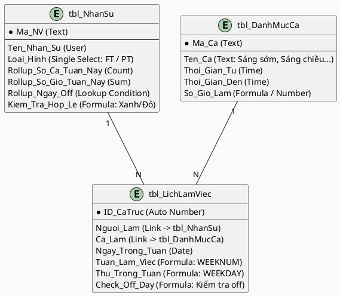

# Báo Cáo Kiến Trúc Giải Pháp SA — Nga Fashion

**Ngày tạo:** 2026-04-11 | **Tham chiếu:** 02_BA_Report | **Kế hoạch Lark:** Free / Basic

## 1. Map Pain Point vào Vấn đề Thiết kế
- **CHUYỂN HOÁ:** Pain P-01 (Đau đầu tính toán quỹ giờ và ngày nghỉ) -> **Design Problem:** Xây dựng một Workspace xếp lịch cho phép tính tự động và hiển thị cảnh báo (Warning Dashboard) ngay trên lưới dữ liệu (Grid) khi có biến số vi phạm.

## 2. Vai Trò của Lark
- **Lark Base** làm *Core Operational Layer*: Lưu trữ bảng nhân sự, danh mục ca, và lịch làm việc mỗi ngày. Cung cấp Data Validation Engine qua Formula và Rollup.
- **Lark Bot** làm *Notifier Layer*: Bắn lịch phân ca đã hoàn thiện vào Group làm việc tổng cuối mỗi tuần.

## 3. Kiến Trúc High-Level
- Quản lý lập lịch tại `Bảng Khai Báo Ca` (Grid / Calendar View).
- Lark Base rollup dữ liệu lại `Bảng Nhân Sự` nhóm theo từng tuần (Week X). Cột Formula thực hiện validate: So sánh chỉ tiêu và thực tế.
- Màu sắc trực quan báo hiệu: 🟢 Hợp lệ ; 🔴 Cần xếp lại lịch.

## 4. Schema Lark Base (Sơ đồ bảng dữ liệu / ERD)

## 5. Giải pháp chi tiết theo Quy Trình (Logic Formula)

**Bảng `tbl_LichLamViec`:**
Sinh ra công thức `Thu_Trong_Tuan` dựa trên cột Ngày. 

**Bảng `tbl_NhanSu` (Phân chia the tuần làm việc):**
Dùng sợi dây liên kết tới `tbl_LichLamViec` theo từng tuần để đếm (Rollup).
- Ràng buộc 1 (FT làm 6 ngày): Kiểm đếm COUNT(Unique Days). `IF(Loai_Hinh="FT" AND Count_Days != 6, "🔴 Sai số ngày", "🟢 Chuẩn")`
- Ràng buộc 2 (Giờ PT = 1/2 Giờ FT): Giả sử target giờ FT/tuần là 40h -> PT là 20h. `IF(Loai_Hinh="PT" AND Rollup_Hours > [1/2 * Target_FT], "🔴 Lố giờ", "🟢 Chuẩn")`
- Ràng buộc 3 (Ngày nghỉ): Tại bảng nhân sự, cấu hình kiểm tra xem những ngày người đó không có record nào trong `tbl_LichLamViec` có rơi vào T2 hoặc CN hay không. (Cách xử lý dễ hơn: Bắt buộc Quản lý tạo record `OFF` trong `tbl_LichLamViec` nếu ngày đó NV được nghỉ, sau đó check xem ngày đó là T2 hay CN).

## 6. Lên cấu trúc Automation & Approval
> **Automation ID:** AUT-001 
> **Trigger:** Lên lịch (Scheduled) - 20h00 tối Thứ 7 Hàng Tuần.
> **Action:** Tìm tất cả Record lịch làm tuần tới trong `tbl_LichLamViec` -> Gửi tin nhắn vào Group Bán Hàng: *"Lịch làm việc tuần sau [Ngày A - Ngày B] đã hoàn tất, các bạn check Lark Base nhé!"* Đính kèm Grid View URL.

## 7. Data Flow & Ownership
Toàn bộ Source of Truth về phân ca nằm trên Lark Base. Dữ liệu này có thể được sử dụng tiếp tục để tính công / lương cuối tháng (nội suy từ tổng số giờ của PT và tổng ca của FT).

## 8. Lộ Trình Triển Khai (Phased Rollout)
- **Phase 1:** Khởi tạo 3 bảng cơ sở Base, setup danh mục ca 06:00 đến 23:00.
- **Phase 2:** Cấu hình Formula Validate, thử nghiệm với dữ liệu giả 1 tuần. Điều chỉnh độ sai lệch của mức giờ (PT = 1/2 FT, sai số +-2h).
- **Phase 3:** Setup Lark Bot gửi thông báo, bàn giao template để cửa hàng sử dụng vào Chủ nhật tuần này.

## 9. Handoff Notes cho UML Engineer
Chuyển tiếp Database Schema tới bước Build. Có thể thiết lập Lark Base tự động qua ERD Script nếu cần tốc độ, vì chỉ bao gồm 3 bảng trọng tâm và liên kết với nhau bằng các hàm cơ bản (Rollup + Link).
