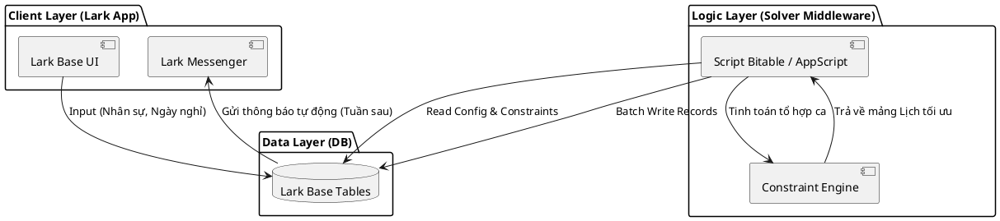
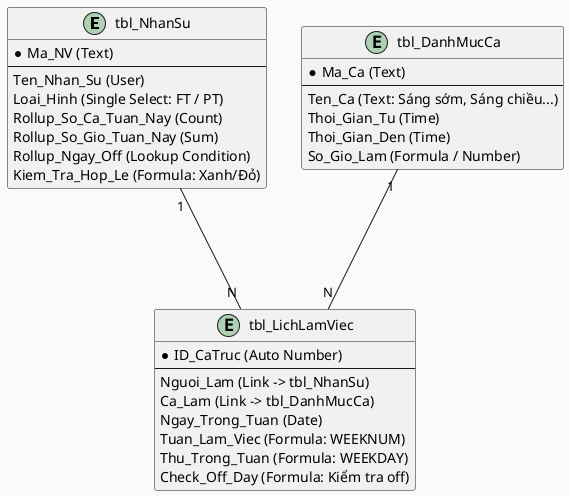

# Báo Cáo Kiến Trúc Giải Pháp SA — Nga Fashion

**Ngày tạo:** 2026-04-11 | **Tham chiếu:** 02_BA_Report | **Kế hoạch Lark:** Free / Basic

## 1. Map Pain Point vào Vấn đề Thiết kế
- **CHUYỂN HOÁ:** Pain P-01 (Đau đầu tính toán quỹ giờ và ngày nghỉ) -> **Design Problem:** Xây dựng hệ thống **Auto-Scheduling** dự trên thuật toán (Solver) để gợi ý lịch làm việc tối ưu cho FT/PT.

## 2. Mô Hình Kiến Trúc Phân Tầng (Layered Architecture)

Giải pháp được xây dựng theo mô hình 3 lớp để đảm bảo tính module và dễ bảo trì:

## 3. Chiến Lược Xử Lý Logic (Solver Algorithm)

Thay vì dùng Formula (bị giới hạn về khả năng tạo dữ liệu), chúng ta sử dụng **Backtracking Algorithm** hoặc **Priority-based Assignment** trong Script:

1.  **Giai đoạn 1 (Preprocessing):** Lấy danh sách Staff, loại bỏ ngày Off đã đăng ký.
2.  **Giai đoạn 2 (Hard Constraints):** Ưu tiên gán FT vào 14 ca Offline (Cố định cửa hàng). Sử dụng cơ chế Round Robin để chia đều ca sáng/chiều.
3.  **Giai đoạn 3 (Role Constraints):** Trám PT vào ca Tối đêm. Kiểm tra chéo: nếu PT nghỉ -> điều chuyển 1 FT làm "2 ca/ngày".
4.  **Giai đoạn 4 (Soft Constraints):** Kiểm tra "Trải đều ca" và "Online < 2 ngày". Nếu vi phạm, thực hiện Swap (Hoán đổi) giữa các ngày để tối ưu.
5.  **Giai đoạn 5 (Post-processing):** Tính toán tổng giờ, làm tròn và ghi vào Base qua API `create_records`.

---

## 4. Đặc Tả Kỹ Thuật (Technical Spec)

### 4.1. Môi trường thực thi (Runtime)
- **Lựa chọn:** **Lark Base Script Extension**.
- **Lý do:** Chạy trực tiếp trên trình duyệt hoặc Lark Client, không cần server ngoài, bảo mật tối đa dữ liệu nhân sự của SME.
- **Trigger:** Nút bấm (Button field) "Xếp ca tự động" tại Bảng điều khiển.

### 4.2. Quản lý Lỗi & Exception Handling
- **Tình huống Không tìm được phương án tối ưu:** Script sẽ không dừng lại mà thực hiện "Best-effort" (Xếp tốt nhất có thể) và trả về Field `Log_Warning` ghi rõ: "Thiếu nhân sự ca X ngày Y".
- **Tình huống API Rate Limit:** Sử dụng cơ chế **Chunking** (Chia nhỏ 50 records/lần gọi) để tránh giới hạn của Lark OpenAPI.

---

## 5. Schema Lark Base (Mở rộng phục vụ Script)

| Bảng | Trường | Kiểu | Vai trò |
|---|---|---|---|
| `tbl_NhanSu` | `Target_Hours` | Number | Chỉ tiêu giờ (FT: 40, PT: 20) |
| `tbl_NhanSu` | `Offline_Count` | Rollup | Đếm số ca Offline trong tuần |
| `tbl_Control` | `Week_Selection` | Date | Chọn tuần cần xếp ca |
| `tbl_Control` | `Trigger_Button` | Button | Nút bấm gọi Script |

---

## 6. Lên cấu trúc Automation & Approval
> **Automation ID:** AUT-001 
> **Trigger:** Lên lịch (Scheduled) - 20h00 tối Thứ 7 Hàng Tuần.
> **Action:** Tìm tất cả Record lịch làm tuần tới trong `tbl_LichLamViec` -> Gửi tin nhắn vào Group Bán Hàng: *"Lịch làm việc tuần sau [Ngày A - Ngày B] đã hoàn tất, các bạn check Lark Base nhé!"* Đính kèm Grid View URL.

## 7. Data Flow & Ownership
Toàn bộ Source of Truth về phân ca nằm trên Lark Base. Dữ liệu này có thể được sử dụng tiếp tục để tính công / lương cuối tháng (nội suy từ tổng số giờ của PT và tổng ca của FT).

## 8. Lộ Trình Triển Khai (Phased Rollout)
- **Phase 1 (Cấu trúc):** Thiết lập 3 bảng Core và hệ thống Formula Cảnh báo.
- **Phase 2 (Logic):** Viết Script Solver xử lý tổ hợp ca ngay trên Base.
- **Phase 3 (Notify):** Cấu hình Lark Bot gửi Card thông báo lịch trực quan.

## 9. ROI & Giá trị mang lại
- **Tiết kiệm:** Giảm thời gian xếp ca từ 3-4 tiếng/tuần xuống còn **5 phút**.
- **Chính xác:** Loại bỏ hoàn toàn sai sót tính toán giờ làm cho PT (vốn gây tranh cãi về lương).
- **Trải nghiệm:** Nhân viên nhận lịch chuyên nghiệp qua Bot, không cần check ảnh chụp màn hình Zalo mờ.

---

## 10. Handoff Notes cho UML Engineer
Chuyển tiếp Database Schema tới bước Build. Tập trung vào việc thiết kế **Sequence Diagram** cho luồng "Script gọi API Base" để đảm bảo tính toàn vẹn dữ liệu khi ghi Patch số lượng lớn.
