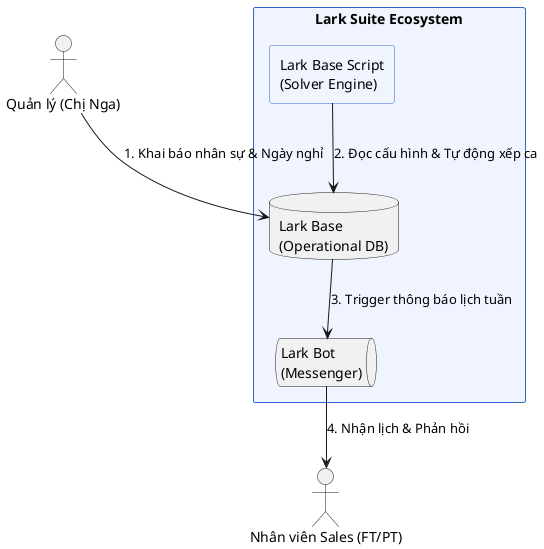
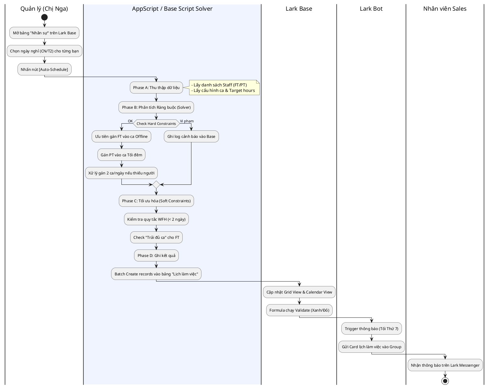
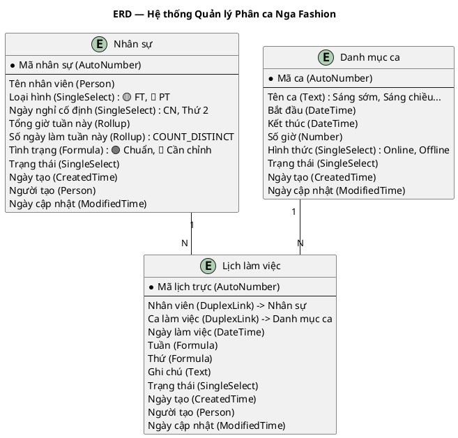
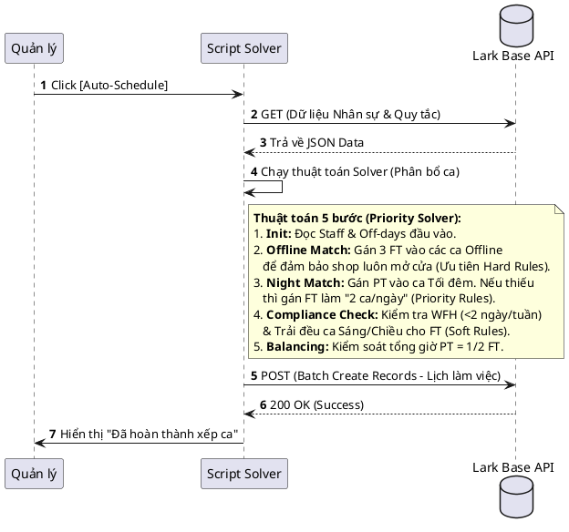

# Báo Cáo Thiết Kế Hệ Thống (UML & ERD) — Nga Fashion

**Ngày tạo:** 2026-04-11 | **Tham chiếu:** 03_SA_Report | **Trạng thái:** Hoàn thành

Tài liệu này cung cấp các bản thiết kế kỹ thuật chi tiết, tuân thủ bộ quy tắc `Tpl_UML_Guide` và `Tpl_LarkBase_Convention`.

---

## 1. Sơ Đồ Ngữ Cảnh (Context Diagram)

Mô tả tổng quan sự tương tác giữa các bên liên quan và hệ sinh thái giải pháp Nga Fashion.

---

## 2. Sơ Đồ Hoạt Động (Swimlane Activity Diagram)

Mô tả quy trình nghiệp vụ và luồng xử lý chi tiết của **AppScript / Base Script Solver**.

---

## 3. Sơ Đồ Thực Thể Liên Kết (ERD - Blueprint)

Bản vẽ thi công chuẩn hóa cho công cụ **Auto-Build**. Tuân thủ `Tpl_LarkBase_Convention`.

---

## 4. Sơ Đồ Trình Tự: Luồng Xử Lý Solver (Message Sequence)

Mô tả cách Script tương tác với API của Lark để ghi dữ liệu.

---
**Ghi chú cho Phase 5 (Auto-Build):**
- Sử dụng các Friendly Name trong ERD (Tiếng Việt) để tạo bảng.
- Đảm bảo thiết lập `multiple: true` cho trường `Nhân viên` trong bảng `Lịch làm việc` nếu cho phép nhiều nhân sự cùng 1 ca.
