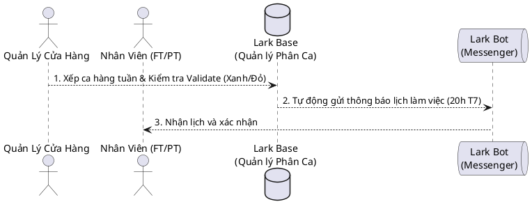
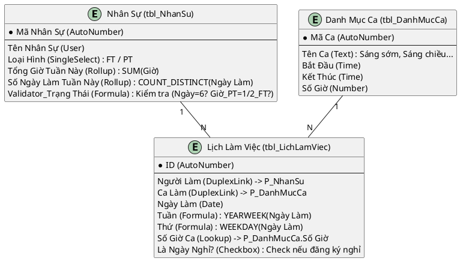
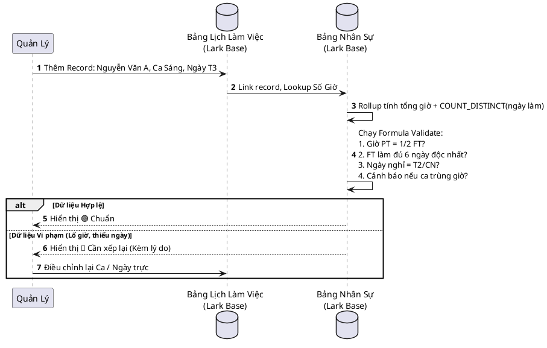
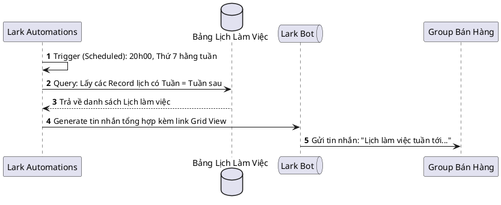

# Báo Cáo Thiết Kế Hệ Thống (UML & ERD) — Nga Fashion

**Ngày tạo:** 2026-04-11 | **Tham chiếu:** 03_SA_Report | **Trạng thái:** Hoàn thành

Tài liệu này cung cấp các bản thiết kế kỹ thuật chi tiết để phục vụ cho giai đoạn Build (Thiết lập Lark Base).

## 1. Sơ Đồ Ngữ Cảnh (Context Diagram)

Sơ đồ tổng quan về cách các bộ phận tương tác với hệ thống quản lý lịch trực.

## 2. Sơ Đồ Thực Thể Liên Kết (ERD - Base Blueprint)

Sơ đồ ERD chuẩn bị cho việc khởi tạo bảng trên Lark Base. Đã định nghĩa rõ các field type tương thích với Lark.

## 3. Sơ Đồ Trình Tự: Logic Cảnh Báo (Validation Logic)

Mô tả luồng Quản lý nhập liệu và hệ thống phản hồi kết quả tính toán giờ làm.

## 4. Sơ Đồ Trình Tự: Tự Động Gửi Lịch (Automation)

---
**Cần chuẩn bị cho Phase 4 (Build):**
- Tạo 3 bảng `tbl_NhanSu`, `tbl_DanhMucCa`, `tbl_LichLamViec`.
- Code chính xác các Formula kiểm duyệt:
  - `IF(AND(Loại Hình='FT', Số Ngày!=6), '🔴 Sai ngày', '🟢 K.Tra Giờ')`
  - Đảm bảo logic tính chéo giờ PT = 1/2 FT (Có thể lấy Target = 20h nếu lập lịch chuẩn 40h).
