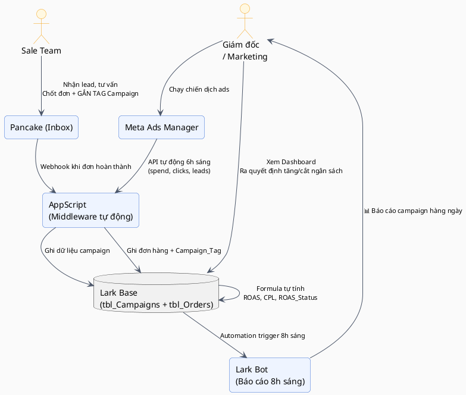
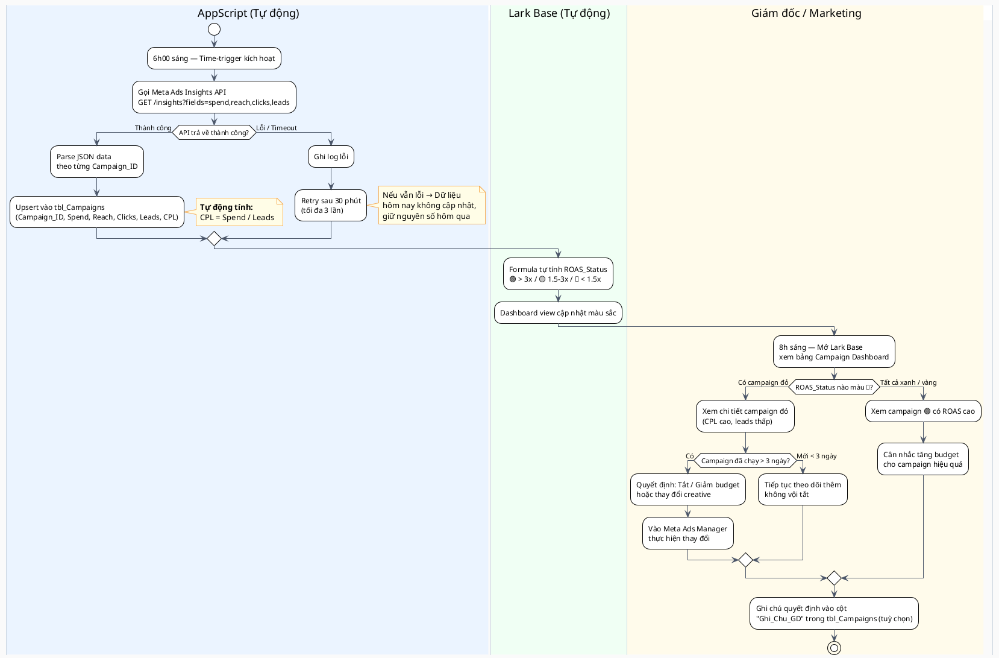
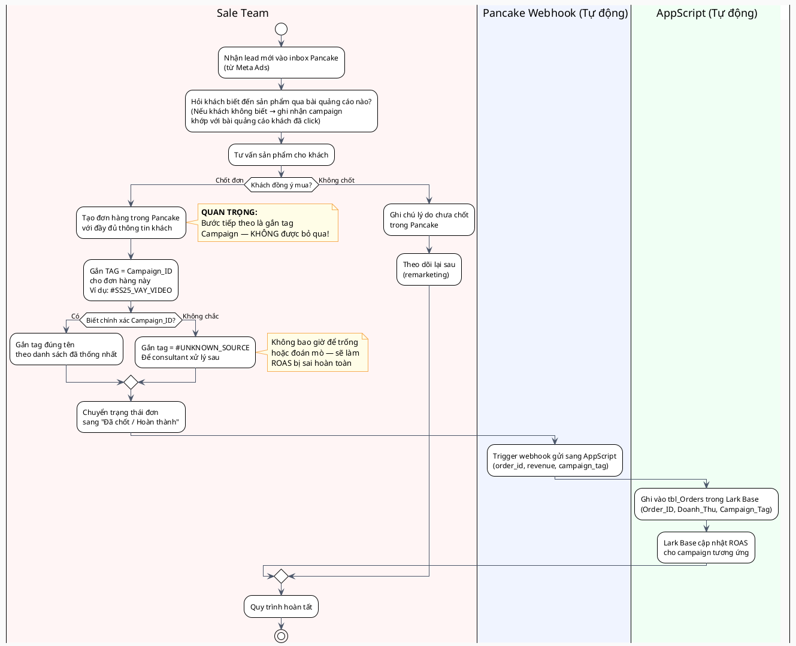
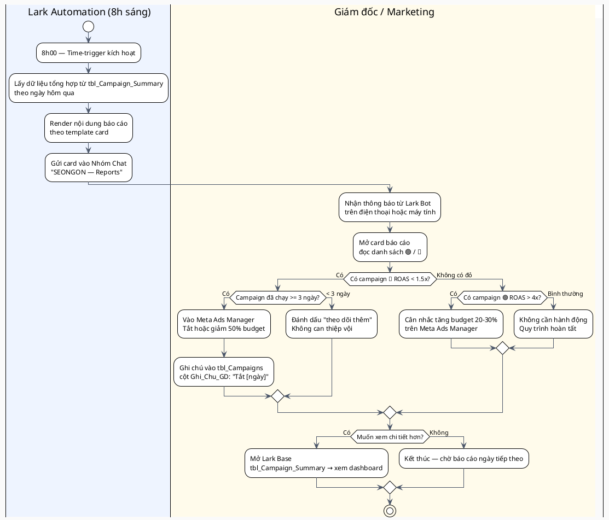

# 📘 Tài Liệu Hướng Dẫn Sử Dụng Hệ Thống — SEONGON

> **Dành cho:** Giám đốc / Marketing & Sale Team của SEONGON
> **Phiên bản:** v1.0 | **Ngày cập nhật:** 2026-04-11 | **Biên soạn:** [Tên Consultant]

---

## 📌 PHẦN 1: GIỚI THIỆU TÀI LIỆU

### 1.1 Mục đích

Tài liệu này được biên soạn để:
- Giúp đội ngũ SEONGON **sử dụng đúng hệ thống Lark** vừa được triển khai cho việc theo dõi hiệu quả quảng cáo Meta Ads.
- Mỗi thành viên biết **chính xác mình cần làm gì, ở đâu, khi nào** — không cần hỏi lại tư vấn viên.
- Giảm thiểu sai sót gây ảnh hưởng đến dữ liệu báo cáo ROAS & CPL.
- Là tài liệu tham khảo khi có nhân sự mới hoặc cần làm lại quy trình.

### 1.2 Đối tượng sử dụng

| Vai trò | Phần cần đọc |
|---|---|
| **Giám đốc / Marketing** | Phần 2 (Tổng quan) + Phần 3 (QT-01, QT-03) + Phần 4 (Role: Giám đốc) |
| **Sale Team** | Phần 2 (Tổng quan) + Phần 3 (QT-02) + Phần 4 (Role: Sale) |

### 1.3 Phạm vi tài liệu

Tài liệu bao gồm hướng dẫn cho **3 quy trình** chính:

- **[QT-01]** Theo dõi và vận hành chiến dịch Meta Ads trên Lark Base
- **[QT-02]** Chốt đơn hàng trên Pancake và gắn tag Campaign đúng cách
- **[QT-03]** Đọc báo cáo tự động từ Lark Bot và ra quyết định ngân sách

> ⚠️ **Ngoài phạm vi:** Cấu hình AppScript, quản lý Meta Ads Manager, thiết lập Pancake webhook — thuộc phạm vi kỹ thuật của consultant.

---

## 🏗️ PHẦN 2: TỔNG QUAN HỆ THỐNG

### 2.1 Các công cụ được sử dụng

| Công cụ | Vai trò trong hệ thống này | Ai sử dụng |
|---|---|---|
| **Meta Ads Manager** | Chạy & quản lý chiến dịch quảng cáo | Giám đốc / Marketing |
| **Pancake** | Nhận lead từ inbox, tư vấn khách, chốt đơn hàng | Sale Team |
| **Lark Base** | Trung tâm dữ liệu: lưu campaign, đơn hàng, tổng hợp ROAS | Giám đốc + Sale |
| **Lark Bot (Automation)** | Gửi báo cáo tự động 8h sáng mỗi ngày vào nhóm chat | Tự động (đọc) |
| **AppScript** | Cầu nối tự động: kéo data từ Meta API + nhận webhook Pancake | Kỹ thuật (ẩn) |

### 2.2 Tổng quan luồng dữ liệu



### 2.3 Cấu trúc dữ liệu trong Lark Base

| Bảng | Nội dung | Nguồn dữ liệu |
|---|---|---|
| `tbl_Campaigns` | Thông tin campaign: spend, leads, CPL, ROAS | Meta Ads API (tự động 6h sáng) |
| `tbl_Orders` | Đơn hàng: doanh thu, Campaign_Tag, trạng thái | Pancake Webhook (khi chốt đơn) |
| `tbl_Campaign_Summary` | Tổng hợp ROAS theo ngày, roll-up từ tbl_Orders | Lark Formula tự động |

---

## 🔄 PHẦN 3: DANH SÁCH QUY TRÌNH CHI TIẾT

---

### [QT-01] Theo dõi Chiến dịch Ads trên Lark Base

**Mô tả:** Mỗi sáng sau 6h, AppScript tự động kéo dữ liệu từ Meta Ads API và ghi vào `tbl_Campaigns`. Giám đốc mở Lark Base để xem tình trạng từng campaign theo màu sắc ROAS.

**Actors tham gia:**
- 🤖 `AppScript` — Chạy tự động lúc 6h sáng, kéo data Meta API, ghi Base
- 👔 `Giám đốc / Marketing` — Xem Dashboard, đọc chỉ số, ra quyết định

#### Sơ đồ Swimlane — QT-01



#### Bảng Thông Tin — Dashboard Campaign (QT-01)

> 🔵 Phần này dành cho Giám đốc khi **đọc và ghi chú** trên Lark Base.

| # | Cột trong Lark Base | Ý nghĩa | Nguồn dữ liệu | Giám đốc có thể sửa? |
|---|---|---|---|---|
| 1 | `Campaign_ID` | Mã định danh campaign (khớp với tag Pancake) | AppScript từ Meta API | ❌ Không sửa |
| 2 | `Ten_Campaign` | Tên chiến dịch đang chạy | AppScript từ Meta API | ❌ Không sửa |
| 3 | `Spend_Thuc_Te` | Số tiền đã chi thực tế (VNĐ) | Meta API tự động | ❌ Không sửa |
| 4 | `So_Lead` | Số lượt lead thu về | Meta API tự động | ❌ Không sửa |
| 5 | `CPL` | Chi phí mỗi lead = Spend / Leads | Lark Formula | ❌ Auto |
| 6 | `ROAS` | Tỷ lệ doanh thu / Chi phí | Lark Formula | ❌ Auto |
| 7 | `ROAS_Status` | 🟢 Tốt / 🟡 Trung bình / 🔴 Cần xem lại | Lark Formula | ❌ Auto |
| 8 | `Trang_Thai` | Đang chạy / Dừng / Kết thúc | Cập nhật từ Meta API | ✅ Có thể sửa thủ công |
| 9 | `Ghi_Chu_GD` | Ghi chú của Giám đốc (lý do tắt/tăng budget) | Giám đốc nhập tay | ✅ Nhập thủ công |

#### Edge Cases & Xử lý — QT-01

| Tình huống | Nguyên nhân | Cách xử lý |
|---|---|---|
| Dashboard không cập nhật đến 9h sáng | AppScript gặp lỗi API / Token hết hạn | Liên hệ consultant. Xem cột `Ngay_Cap_Nhat` — nếu là hôm qua nghĩa là lỗi |
| ROAS tính ra 0 hoặc lạ | `So_Lead = 0` (chia cho 0) | Bình thường với campaign mới. Chờ có lead mới tính được |
| Campaign có ROAS cao nhưng ít đơn | Data Meta và Pancake chưa khớp, lead nhiều nhưng chưa chốt | Xem thêm cột `Tong_Don` trong tbl_Campaign_Summary để đối chiếu |
| Không thấy campaign mới trong Base | Campaign mới tạo chưa có ID khớp | GĐ cần đặt Campaign_ID trong Meta trùng với Convention đã thống nhất |

---

### [QT-02] Chốt Đơn Hàng + Gắn Tag Campaign trên Pancake

**Mô tả:** Khi khách hàng chốt đơn qua inbox Pancake, Sale Team phải gắn tag Campaign đúng tên để hệ thống tự động tính ROAS chính xác. Đây là bước quan trọng nhất — nếu quên hoặc gắn sai, toàn bộ báo cáo attribution sẽ sai....

**Actors tham gia:**
- 🧑‍💼 `Sale Team` — Tư vấn, chốt đơn, gắn tag Campaign
- 🤖 `Pancake Webhook` — Tự động đẩy dữ liệu đơn về AppScript khi trạng thái = "Hoàn thành"
- 🤖 `AppScript` — Nhận webhook, ghi vào tbl_Orders trong Lark Base

#### Sơ đồ Swimlane — QT-02



#### Bảng Thông Tin Form — Tạo Đơn Hàng trong Pancake (QT-02)

> 🔵 Sale team điền các thông tin sau khi tạo đơn hàng trong Pancake.

| # | Bước | Trường thông tin | Kiểu | Bắt buộc | Hướng dẫn điền |
|---|---|---|---|---|---|
| 1 | Tạo đơn | **Tên khách hàng** | Text | ✅ | Ghi đúng tên, không viết tắt |
| 2 | Tạo đơn | **Số điện thoại** | Phone | ✅ | Định dạng: 09xxxxxxxx |
| 3 | Tạo đơn | **Địa chỉ giao hàng** | Text | ✅ | Ghi đủ số nhà, đường, phường/xã, quận, tỉnh |
| 4 | Tạo đơn | **Sản phẩm** | Text / Dropdown | ✅ | Chọn từ danh sách sản phẩm có sẵn |
| 5 | Tạo đơn | **Số lượng** | Số | ✅ | Nhập số nguyên |
| 6 | Tạo đơn | **Doanh thu đơn hàng** | Currency (VNĐ) | ✅ | Giá trị sau chiết khấu nếu có |
| 7 | **Gắn Tag** | **Campaign_Tag** ⭐ | Tag / Label | ✅ **QUAN TRỌNG** | Dùng đúng tên Campaign_ID theo danh sách → xem bảng ở dưới |
| 8 | Hoàn thành | **Trạng thái đơn** | Single Select | ✅ | Chuyển sang `Đã chốt` hoặc `Hoàn thành` để trigger webhook |
| 9 | Tùy chọn | **Ghi chú** | Text | ❌ | Ghi kênh tư vấn, note đặc biệt của khách nếu có |

#### Danh Sách Campaign_ID Hợp Lệ

> ⚠️ **Chỉ được dùng đúng các Campaign_ID trong danh sách này.** Viết sai → dữ liệu không khớp → ROAS sai.

| Campaign_ID (Dùng làm TAG) | Mô tả campaign | Trạng thái |
|---|---|---|
| `SS25_VAY_VIDEO` | Spring 2025 — Video quảng cáo váy hè | 🟢 Đang chạy |
| `SS25_AO_FLASH` | Flash sale áo sơ mi hè | 🟢 Đang chạy |
| `TEST_VIDEO_AO` | Test creative video áo — A/B test | 🟡 Testing |
| `UNKNOWN_SOURCE` | Không xác định được nguồn | ⚪ Dự phòng |

> 📌 **Khi GĐ tạo campaign mới trên Meta**, phải thông báo ngay cho sale team biết Campaign_ID mới để thống nhất tag.

#### Edge Cases & Xử lý — QT-02

| Tình huống                                            | Nguyên nhân                               | Cách xử lý                                                                                                          |
| ----------------------------------------------------- | ----------------------------------------- | ------------------------------------------------------------------------------------------------------------------- |
| Quên không gắn tag khi chốt đơn                       | Sale team bỏ sót bước                     | Vào lại đơn trong Pancake → chỉnh sửa tag trước khi cuối ngày. Nếu quá hạn → báo consultant cập nhật tay trong Base |
| Khách đến từ nhiều chiến dịch (đã xem nhiều bài)      | Khách click nhiều bài quảng cáo khác nhau | Ưu tiên tag campaign **cuối cùng** khách nhắc đến hoặc bài đầu tiên thu hút                                         |
| Đơn hàng hoàn (refund) đã tính ROAS                   | Khách hủy sau khi đã ghi nhận             | Báo consultant để cập nhật trạng thái đơn trong Base về "Hủy" — ROAS sẽ được điều chỉnh                             |
| Pancake không gửi webhook (đơn không hiện trong Base) | Webhook bị gián đoạn                      | Kiểm tra trạng thái đơn: phải là "Hoàn thành", không phải "Đang xử lý". Báo consultant nếu vẫn thiếu                |

---

### [QT-03] Đọc Báo Cáo Lark Bot và Ra Quyết Định

**Mô tả:** Mỗi 8h sáng, Lark Bot tự động gửi báo cáo tổng hợp vào nhóm chat của Giám đốc và Sale Team. Giám đốc đọc và ra quyết định tăng/tắt/chỉnh sửa campaign trong ngày.

**Actors tham gia:**
- 🤖 `Lark Bot` — Gửi card báo cáo tự động
- 👔 `Giám đốc / Marketing` — Đọc báo cáo, đưa ra hành động
- *(Sale Team chỉ đọc để nắm tình hình, không cần thao tác)*

#### Sơ đồ Swimlane — QT-03



#### Cấu Trúc Card Báo Cáo Lark Bot

> 🔵 Mẫu card Lark Bot gửi mỗi 8h sáng:

```
📊 Báo cáo Ads ngày [DD/MM/YYYY] — SEONGON

🟢 Hiệu quả tốt:
  • SS25_VAY_VIDEO — ROAS 4.2x | 8 đơn | CPL 38,000đ
  • SS25_AO_FLASH  — ROAS 3.1x | 5 đơn | CPL 52,000đ

🟡 Trung bình:
  • TEST_VIDEO_AO  — ROAS 1.8x | 2 đơn | CPL 95,000đ

🔴 Cần xem lại:
  • [Campaign X]   — ROAS 0.8x | 1 đơn | CPL 210,000đ

💰 Tổng chi hôm qua: 2,400,000đ
📦 Tổng đơn xác nhận: 16 đơn
📈 ROAS trung bình: 2.9x
```

#### Edge Cases & Xử lý — QT-03

| Tình huống | Nguyên nhân | Cách xử lý |
|---|---|---|
| Không nhận được báo cáo 8h sáng | Lark Bot offline hoặc lỗi Automation | Vào `Lark Base → tbl_Campaign_Summary` xem thủ công. Báo consultant |
| Báo cáo thiếu campaign | Campaign chưa có data trong Base (mới tạo) | Bình thường với campaign < 1 ngày. Ngày hôm sau sẽ có |
| ROAS trong bot khác với Meta Ads Manager | Meta tính ROAS khác (dựa lead), hệ thống tính ROAS dựa đơn thật | Đây là sự khác biệt có chủ ý — số trong Bot **chính xác hơn** vì tính từ đơn thật Pancake |
| Sale team gắn sai tag, ROAS bị lệch | Xem xét ROAS bị tính vào campaign sai | Báo consultant để merge/fix data trong Base |

---

## 👤 PHẦN 4: HƯỚNG DẪN THEO TỪNG VAI TRÒ

---

### 👔 Role: Giám đốc / Marketing

**Mô tả vai trò:** Người ra quyết định chiến lược quảng cáo. Sử dụng hệ thống để đọc báo cáo tự động và xem Dashboard ROAS mỗi ngày, từ đó điều chỉnh ngân sách trên Meta Ads Manager.

**Bạn tham gia các quy trình:**
- **[QT-01]** Theo dõi Campaign trên Lark Base — với tư cách **Người đọc Dashboard + Ra quyết định**
- **[QT-03]** Đọc báo cáo Bot 8h sáng — với tư cách **Người tiếp nhận báo cáo + Hành động**

---

#### 🔵 Usecase 1: Xem Dashboard Campaign trên Lark Base *(QT-01)*

**Khi nào thực hiện:** Hàng ngày sau 8h sáng khi muốn xem chi tiết campaign hơn báo cáo Bot.

**Bước 1 — Mở Lark Base**
> Vào app Lark → `Workspace` → `SEONGON — Ads Analytics` → Mở `tbl_Campaigns`

**Bước 2 — Lọc theo ngày hôm nay**
> Trong bảng → Click `Filter` → Chọn cột `Ngay_Cap_Nhat` → Giá trị = ngày hôm nay

**Bước 3 — Đọc chỉ số theo màu sắc**

| Màu cột ROAS_Status | Ý nghĩa | Hành động gợi ý |
|---|---|---|
| 🟢 (Xanh — ROAS > 3x) | Campaign hiệu quả tốt | Xem xét tăng budget 20-30% |
| 🟡 (Vàng — ROAS 1.5-3x) | Hiệu quả trung bình | Giữ nguyên, theo dõi thêm |
| 🔴 (Đỏ — ROAS < 1.5x) | Đang lỗ hoặc không hiệu quả | Xem xét tắt hoặc edit creative |

**Bước 4 — Ghi chú quyết định (tùy chọn)**
> Click vào record campaign → Click cột `Ghi_Chu_GD` → Nhập ghi chú

| Trường | Nội dung cần điền | Ví dụ |
|---|---|---|
| `Ghi_Chu_GD` | Lý do hành động / Ghi chú theo dõi | `"Đã tắt ngày 11/04 — CPL tăng gấp đôi"` |

**Kết quả mong đợi:** Bạn biết chính xác campaign nào cần hành động và đã có ghi chú để theo dõi lịch sử quyết định.

---

#### 🔵 Usecase 2: Đọc báo cáo Lark Bot buổi sáng *(QT-03)*

**Khi nào thực hiện:** Mỗi ngày lúc 8h sáng khi nhận được tin nhắn từ Bot trong nhóm chat.

**Bước 1 — Mở nhóm chat nhận báo cáo**
> App Lark → Nhóm `SEONGON — Reports` → Xem tin nhắn mới từ Bot

**Bước 2 — Đọc và phân tích nhanh**

| Thông tin cần xem | Ý nghĩa |
|---|---|
| Danh sách 🟢 (Tốt) | Campaign đang sinh lời, có thể scale |
| Danh sách 🔴 (Xem lại) | Campaign cần giảm/tắt |
| `CPL` (Chi phí mỗi lead) | So sánh với benchmark ngành: Fashion SME nên < 80k |
| `Tổng đơn xác nhận` | Kiểm tra xem Sale có gắn tag đầy đủ không |

**Bước 3 — Ra quyết định và thực hiện trên Meta Ads Manager**
> - Nếu cần tắt/giảm campaign → Vào Meta Ads Manager → Tìm theo tên → Thực hiện
> - Quay lại Lark Base → Ghi chú vào `Ghi_Chu_GD`

**Kết quả mong đợi:** Trong 10 phút đã biết ngân sách hôm nay cần điều chỉnh gì, không cần mở thêm tab khác.

---

### 🧑 Role: Sale Team

**Mô tả vai trò:** Nhận lead từ inbox Pancake, tư vấn và chốt đơn. **Nhiệm vụ quan trọng nhất trong hệ thống:** Gắn đúng Campaign_Tag cho từng đơn hàng để đội Marketing biết campaign nào thật sự hiệu quả.

**Bạn tham gia các quy trình:**
- **[QT-02]** Chốt đơn + Gắn tag Campaign — với tư cách **Người thực hiện chính**
- **[QT-03]** Đọc báo cáo Bot — với tư cách **Người theo dõi** (không cần hành động)

---

#### 🔵 Usecase 1: Tạo đơn hàng và gắn tag Campaign *(QT-02)*

**Khi nào thực hiện:** Mỗi khi khách hàng đồng ý mua hàng qua inbox Pancake.

**Bước 1 — Xác định Campaign_ID của khách**
> Trước khi tạo đơn, hỏi hoặc xác định khách đến từ chiến dịch nào:
> - Hỏi: *"Bạn thấy sản phẩm qua bài quảng cáo nào ạ?"*
> - Hoặc: Nhìn vào nguồn/nhãn của hội thoại trong Pancake

**Bước 2 — Tạo đơn hàng trong Pancake**

| Trường | Nội dung cần điền | Ví dụ | Bắt buộc |
|---|---|---|---|
| **Tên khách** | Họ và tên đầy đủ | `Nguyễn Thị Mai` | ✅ |
| **SĐT** | Số điện thoại liên lạc | `0912345678` | ✅ |
| **Địa chỉ** | Đủ số nhà, đường, phường, quận, tỉnh | `123 Lê Lợi, P. Bến Nghé, Q.1, HCM` | ✅ |
| **Sản phẩm** | Chọn từ danh sách | `Váy Hoa Mùa Hè — Size M` | ✅ |
| **Số lượng** | Số nguyên | `2` | ✅ |
| **Doanh thu** | Tổng tiền sau giảm giá | `580,000` | ✅ |

**Bước 3 — Gắn TAG Campaign** ⭐ **Quan trọng nhất**
> Trong Pancake → Tìm trường `Tag` hoặc `Label` → Gắn đúng Campaign_ID

| Tình huống | Campaign_ID cần gắn |
|---|---|
| Khách từ video váy hè Spring 2025 | `SS25_VAY_VIDEO` |
| Khách từ flash sale áo | `SS25_AO_FLASH` |
| Đang test creative video áo | `TEST_VIDEO_AO` |
| Không xác định được | `UNKNOWN_SOURCE` |

> ⚠️ **KHÔNG ĐƯỢC:** Để trống tag hoặc đặt tag tự do ngoài danh sách trên.

**Bước 4 — Chuyển trạng thái đơn sang "Hoàn thành"**
> Sau khi xác nhận đơn → Chuyển status → `Đã chốt` hoặc `Hoàn thành`
> *(Webhook tự động gửi về Lark Base — không cần làm thêm gì)*

**Kết quả mong đợi:** Đơn hàng xuất hiện trong `tbl_Orders` tại Lark Base trong vòng 1-2 phút, ROAS của campaign tương ứng tự động cập nhật.

---

#### 🔵 Usecase 2: Xử lý khi không biết Campaign của khách *(QT-02 — Edge case)*

**Khi nào thực hiện:** Khách không nhớ hoặc không nói được đến từ chiến dịch nào.

**Bước 1:** Thử gợi ý cho khách
> *"Bạn có nhớ thấy quảng cáo váy hay áo không ạ? Hay thấy video hay ảnh tĩnh?"*

**Bước 2:** Nếu vẫn không xác định được
> Gắn tag: `UNKNOWN_SOURCE`
> Ghi chú vào trường `Ghi chú đơn hàng`: *"Không xác định nguồn — [ngày]"*

**Bước 3:** Cuối tuần báo cáo nội bộ
> Sale lead tổng hợp số lượng `UNKNOWN_SOURCE` trong tuần → Nếu > 20% → Cần cải thiện quy trình hỏi nguồn

---

## ❓ PHẦN 5: CÂU HỎI THƯỜNG GẶP

| Câu hỏi | Trả lời |
|---|---|
| Tôi không thấy dữ liệu trong Lark Base cập nhật? | Kiểm tra cột `Ngay_Cap_Nhat`. Data cập nhật sau 6h sáng. Nếu vẫn là ngày hôm qua → liên hệ consultant |
| Tại sao ROAS trong Bot khác Meta Ads? | Bot tính ROAS từ đơn thật Pancake. Meta tính theo pixel/lead form. Bot chính xác hơn |
| Sale quên gắn tag, giờ phải làm gì? | Vào Pancake sửa tag trước 23h cùng ngày. Sau đó báo consultant để sync lại |
| Tôi cần thêm Campaign_ID mới vào danh sách? | Báo GĐ → GĐ thống nhất tên → Báo consultant thêm vào Base và cập nhật bảng danh sách |
| Bot không gửi báo cáo sáng nay? | Mở Lark Base xem tay. Báo consultant qua chat |
| Tôi có thể tự thêm record vào tbl_Campaigns không? | Không nên — dữ liệu sẽ bị ghi đè bởi API vào sáng hôm sau |

---

## 📞 PHẦN 6: HỖ TRỢ & LIÊN HỆ

| Vấn đề | Liên hệ | Kênh |
|---|---|---|
| Lỗi kỹ thuật: Bot không gửi / Data không cập nhật | [Tên Consultant] | Lark Chat: @[Username] |
| Sale gắn sai tag, cần fix data | [Tên Consultant] | Lark Chat hoặc ghi rõ vào group |
| Câu hỏi về quy trình nội bộ | Giám đốc / Marketing | Nhóm chat nội bộ SEONGON |
| Yêu cầu thêm tính năng / thay đổi | [Tên Consultant] | Email: [email] — phản hồi trong 24h |

---

## 📋 PHỤ LỤC: BẢNG TRA CỨU NHANH

### A. Mapping Campaign_ID → Tên chiến dịch

| Campaign_ID | Tên đầy đủ | Thời gian chạy | Sản phẩm |
|---|---|---|---|
| `SS25_VAY_VIDEO` | Spring 2025 — Video váy hè | Cập nhật khi chạy | Váy |
| `SS25_AO_FLASH` | Flash sale áo sơ mi | Cập nhật khi chạy | Áo |
| `TEST_VIDEO_AO` | A/B Test video áo | Testing | Áo |
| `UNKNOWN_SOURCE` | Không rõ nguồn | — | — |

### B. Ngưỡng đánh giá ROAS

| Chỉ số | Ngưỡng | Ý nghĩa | Hành động |
|---|---|---|---|
| ROAS | > 4x 🟢 | Rất tốt | Scale budget |
| ROAS | 3-4x 🟢 | Tốt | Duy trì |
| ROAS | 1.5-3x 🟡 | Trung bình | Theo dõi |
| ROAS | < 1.5x 🔴 | Kém | Tắt / Edit |
| CPL | < 60k 🟢 | Tốt | Duy trì |
| CPL | 60-100k 🟡 | Chấp nhận | Tối ưu dần |
| CPL | > 100k 🔴 | Cao | Xem lại targeting / creative |

---

*© Tài liệu biên soạn bởi [Tên Consultant / Lark Consult] — Cập nhật lần cuối: 2026-04-11*
*Mọi yêu cầu chỉnh sửa tài liệu gửi về: [email consultant]*
